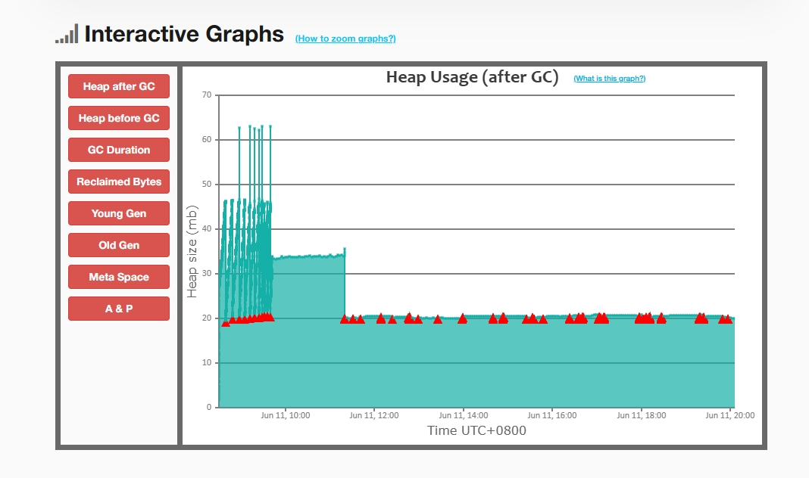
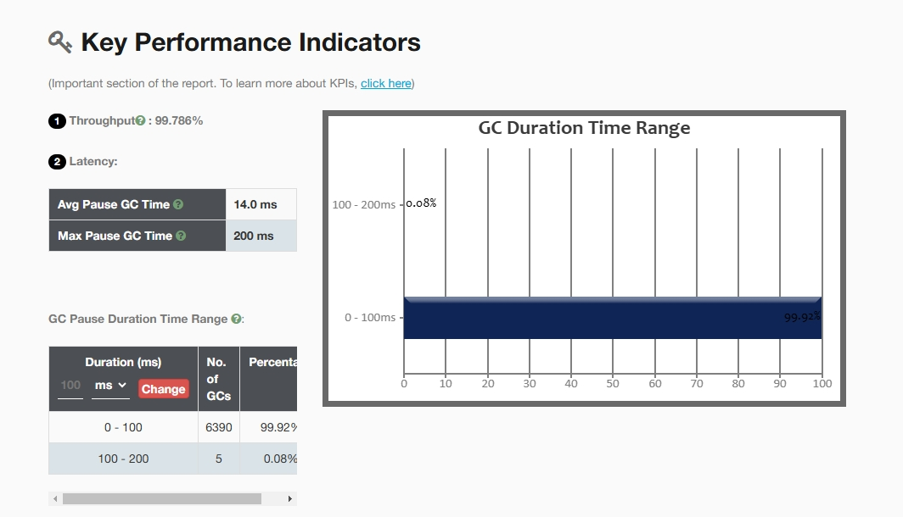

#### JVM压力测试

压测接口：111.229.122.55:8080/city/items

目标是减少Full GC次数

引发Full GC的原因

* Metaspace触发阈值
* 内存担保失败，触发Ergonomics 工程学GC
* 老年代堆内存已满

1. 观测数据

   

结论：元空间过小，触发GC

2. 第一次内存调优

   当前设置-Xms64m -Xmx64m  -Xmn18m -XX:MetaspaceSize=64m -XX:MaxMetaspaceSize=64m

   

结论：随着压力测试的增加，老年代堆内存触顶，内存担保失败 触发Ergonomics GC。

3. 第二次调优

   -Xms184m -Xmx184m  -XX:MetaSpaceSize=128m -XX:MaxMetaSpaceSize=128m

   

结论：Metaspace大小合适，堆内存依旧存在优化空间。

4. 第三次调优

-Xms448m -Xmx448m  -Xmn168m -XX:MetaSpaceSize=128m -XX:MaxMetaSpaceSize=128m

结论：当前未出现Full GC，吞吐量趋于稳定

垃圾收集器的配置(堆内存大小设置： -Xms64m -Xmx64m  -Xmn18m)

1. Parallel Old吞吐量优先，参照图上第一次调优结果。

2. ParNew + CMS

   

   

   

   

结论：CMS垃圾收集器，细分垃圾收集的步骤。吞吐量出现下降 ，GC暂停时间为 9min 52s。

3. G1垃圾收集器

   

   

结论：G1相较于CMS 暂停时间只有48s。充分使用Mixed GC回收年轻代和部分老年代。吞吐量没有受到影响。

