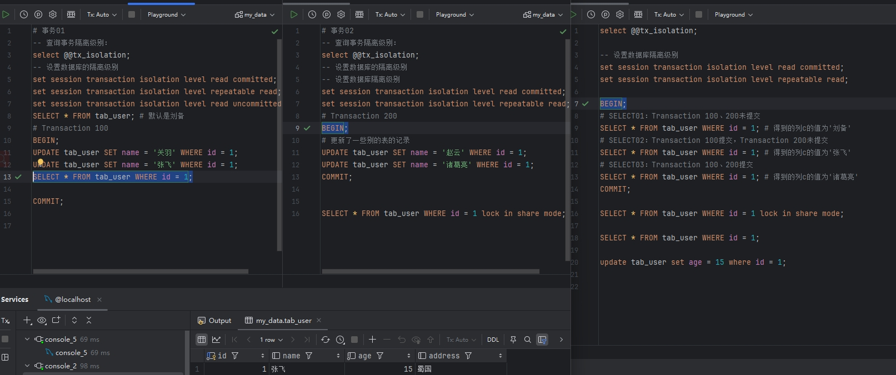

#### 事务

1. 什么是MVCC？

   主旨读不加锁，读写不冲突。

   * MVCC使用类似于git版本管理方式对于update和delete操作进行SQL记录的版本管理，事务提交后等待后续线程清除undo log日志。对于insert操作由于之前没有记录，无需管理之前的版本，事务提交后删除undoLog日志即可。

   * 对于查询语句使用快照读，读取符合的版本。

* undo 日志

  对于MySQL数据行，存在隐藏列，row_id 、trx_id、roll_ptr。row_id 默认为当前表的主键ID，如果未设置主键则按选择第一个非空唯一键作为 row_id。trx_id 表示当前SQL 执行时对应的事务编号。roll_ptr 用于对于同一SQL行记录的版本之间的关联。undo日志可以用于事务的回滚。

* ReadView

  在读已提交和可重复读的事务隔离级别下，ReadView共有m_ids、m_low_limit_id、m_up_limit_id、m_creator_trx_id。m_ids表示当前ReadView下 还未提交的事务ID，m_low_limit_id在当前为提交的事务ID中最小的事务ID，m_up_limit_id 表示创建下一个事务ID的编号，m_creator_trx_id表示当前事务ID的编号

* 如何判断可见性

  * 在读已提交事务隔离级别下，每次select语句都会创建一个ReadView

  * 在可重复读的事务隔离级别下，第一次select语句会创建一个ReadView

    找到同一条行记录的Undo版本链，依次用trx_id 判断：

    * 如果trx_id 小于m_low_limit_id，表示当前事务在ReadView创建之前已经提交，属于可见性数据
    * 如果trx_id等于ReadView的事务ID，表示当前SQL更新记录是在当前ReadView事务中产生，属于可见性数据
    * 如果trx_id大于m_up_limit_id，表示当前事务在ReadView创建之后 新建的事务，属于不可见数据
    * 如果trx_id 在m_ids之间，表示当前事务还未提交属于不可见数据，若不在m_ids之间，表示当前事务已经提交属于可见性数据

  * 当当前trx_id 为不可见数据时，需要按照Undo日志的版本链 寻找上一个版本的trx_id， 再次进行可见性判断，直到找到可见的trx_id版本记录

  数据库中新插入一条SQL 名称为刘备

| 时间 | 事务1      | 事务2        | 事务3 （生成ReadView） |
| ---- | ---------- | ------------ | ---------------------- |
| T1   | 开启事务   | 开启事务     | 开启事务               |
| T2   | 更新为关羽 |              |                        |
| T3   | 更新为张飞 |              |                        |
| T4   |            |              | SELECT01               |
| T5   | 提交事务1  |              |                        |
| T6   |            | 更新为赵云   |                        |
| T7   |            | 更新为诸葛亮 |                        |
| T8   |            |              | SELECT02               |
| T9   |            | 提交事务2    |                        |
| T10  |            |              | SELECT03               |

2. 案例 01- 读已提交 RC 隔离级别下的可见性分析

* 分析事务不同时期的可见性

* 实践过程

  * T1时刻，设置隔离级别 并开启事务

  

  * T3时刻，Undo Log版本链中 张飞[事务1]----> 关羽[事务1]----> 刘备

    

  * T4时刻，Undo Log版本链中 张飞[事务1]----> 关羽[事务1]----> 刘备。生成ReadView事务3发现事务1处于活跃中，只能读取版本为刘备的数据

    

  * T7时刻，Undo Log版本链中 诸葛亮[事务2]----->赵云[事务2]---->张飞[事务1]----> 关羽[事务1]----> 刘备。

  

  * T8时刻，Undo Log版本链中 诸葛亮[事务2]----->赵云[事务2]---->张飞[事务1]----> 关羽[事务1]----> 刘备。再次生成ReadView事务3发现事务2处于活跃中，只能读取版本为张飞的数据

    

  * T10时刻，Undo Log版本链中 诸葛亮[事务2]----->赵云[事务2]---->张飞[事务1]----> 关羽[事务1]----> 刘备。再次生成ReadView，发现没有活跃的事务，读取版本为诸葛亮的数据

    

* 结论：T4时刻记录为刘备，T8时刻记录为张飞，T10时刻记录为诸葛亮

3. 案例 02- 可重复读 RR 隔离级别下的可见性分析

* 分析事务不同时期的可见性

* 实践过程

  * T1时刻，设置隔离级别 并开启事务

    

  * T3时刻，Undo Log版本链中 张飞[事务1]----> 关羽[事务1]----> 刘备

    

  * T4时刻，Undo Log版本链中 张飞[事务1]----> 关羽[事务1]----> 刘备。生成ReadView事务3发现事务1处于活跃中，只能读取版本为刘备的数据

    

  * T7时刻，Undo Log版本链中 诸葛亮[事务2]----->赵云[事务2]---->张飞[事务1]----> 关羽[事务1]----> 刘备。

    

  * T8时刻，Undo Log版本链中 诸葛亮[事务2]----->赵云[事务2]---->张飞[事务1]----> 关羽[事务1]----> 刘备。使用之前的ReadView发现事务1、2处于活跃中，只能读取版本为刘备的数据

    

  * T10时刻，Undo Log版本链中 诸葛亮[事务2]----->赵云[事务2]---->张飞[事务1]----> 关羽[事务1]----> 刘备。使用之前的ReadView发现事务1、2处于活跃中，只能读取版本为刘备的数据

    

* 结论：T4时刻记录为刘备，T8时刻记录为刘备，T10时刻记录为刘备

3. 结论分析：RC和RR的隔离级别下，对于Undo Log日志的版本相同，RR只有第一次select查询生成ReadView，而RC每次查询都生成一个新的ReadView，所以可以获取当前ReadView事务ID之前创建的且已经提交的事务ID的SQL记录

4. 什么是索引？

   索引是可以加快查询的数据结构

* 优点
  * 加快查询速度，减少IO成本
  * 方便索引列的排序
* 缺点
  * 创建索引会占用磁盘空间
  * 更新数据需要同步更新索引，增加维护成本

5. 索引分类有哪些？特点是什么？

   * 主键索引，索引列的数值要求非空唯一键
   * 普通索引，因为现在数据库表字段的创建基本不允许为空，允许索引列重复。
   * 唯一键，普通索引 + 唯一性约束

   * 全文索引， 适用于字符类型，现在主要采用Es当前很少使用
   * RTree ，空间索引
   * 前缀索引，适用于文本型、字符型数据结构字段
   * 组合索引，需要满足最左匹配原则，创建组合索引的时候，先考虑等值查询，后考虑区分度，e.g:  a, b 两个字段，a的区分度低，但是场景中使用为等值查询，b字段区分度高，但是场景中使用为范围查询。所以创建组合索引推荐为 a,b

6. 索引创建的原则是什么？

   * 使用场景中频繁出现在where 条件、order排序、group by可以考虑创建索引

   * 一般来说生产环境禁止join表， 但多表join查询的关联字段仍然需要建索引
   * 对于区分度不高的字段，可以创建组合索引。对于组合索引，等值查询优先级大于区分度

7. 有哪些使用索引的注意事项？

   * 数据量较小的不需要创建索引，也不用在乎全表查询的问题，如果数据不怎么改动，例如：税率表，可以考虑使用本地缓存
   * 尽量创建组合索引，而不是创建单列索引。可以方便使用索引覆盖，不需要回表查询

8. 如何知道 SQL 是否用到了索引？

   * 可以explain查看执行计划，等值查询为ref级、范围查询为Range级，全表查询为All

9. 请你解释一下索引的原理是什么？

   * 索引是用来降低查找数据的时间复杂度，索引需要考虑等值查询和范围查询的场景，全表查询的时间复杂度为O(n)， Hash时间复杂度为O(1)、平衡二叉树的时间复杂度为Log2N

   * Hash表适用于等值查询，而非范围查询，且不满足排序功能
   * 平衡二叉树 适用于等值查询，范围查询需要从根节点重新查询，且树的高度仍然有优化的空间
   * B树 适用于等值查询，范围查询需要从根节点重新查询。
   * B+树 在B树的基础上，非叶子节点不再存储数据，只存储索引列。而叶子节点存储数据。这样同等的磁盘页大小可以存储更多的节点，降低树的高度，也就降低了IO成本。同时更新数据时，更多需要维护关注叶子节点，降低维护成本。且支持范围查询

